# Auth Error Outbox Pipeline

인증(Auth) 과정에서 발생하는 오류 이벤트를

**트랜잭셔널 아웃박스 패턴(Transactional Outbox Pattern)** 으로 수집하고,

비동기 처리 파이프라인을 통해 **AI 기반 요약·분석 시스템으로 전달하기 위한 백엔드 인프라 프로젝트입니다.**

---

## Project Goal

이 프로젝트의 목표는 단순한 메시지 발행이 아니라,

- 인증 오류 이벤트를 **유실 없이 수집**
- 장애 상황에서도 **재처리 가능한 상태로 관리**
- 누적된 오류 이벤트를 기반으로 **AI 분석 및 요약에 활용**

할 수 있는 **신뢰 가능한 이벤트 파이프라인**을 구축하는 것입니다.

---

## Architecture Overview

### Components

- **Poller**: 처리 가능한 메시지를 claim
- **Processor**: 메시지 처리 및 상태 전이
- **Reaper**: 장시간 PROCESSING 상태 메시지 회수
- **Publisher**: 메시지 브로커 연동 (RabbitMQ 예정)

---

## Message Lifecycle

| Status | Description |
| --- | --- |
| `PENDING` | 처리 대기 |
| `PROCESSING` | poller에 의해 claim |
| `PUBLISHED` | 정상 처리 완료 |
| `DEAD` | 재시도 초과 |

---

## State Transition Diagram

---

## Reliability Strategy

- Idempotency Key 기반 중복 방지
- 재시도 횟수 및 다음 처리 시점(`next_retry_at`) 관리
- Reaper를 통한 stuck 메시지 회수
- 상태 기반 전이로 메시지 유실 방지

---

## Testing Strategy

- **PostgreSQL(Testcontainers)** 기반 통합 테스트
- Poller / Processor / Reaper 흐름 검증
- 테스트 전용 Publisher를 사용해
    - 성공
    - 실패
    - 재시도
    - DEAD 전이 시나리오를 의도적으로 재현

---

## Tech Stack

- Java 21
- Spring Boot
- Spring Data JPA
- PostgreSQL
- Testcontainers
- JUnit 5

---

## Current Status

- [x]  Outbox 테이블 및 상태 전이
- [x]  Poller / Processor / Reaper 구성
- [x]  재시도 및 DEAD 처리
- [x]  Idempotency 기반 중복 방지
- [x]  DB 기반 통합 테스트
- [ ]  RabbitMQ 실제 연동
- [ ]  AI 요약 및 분석 파이프라인 연결
- [ ]  장애 패턴 기반 분석 고도화

---

## Why This Matters

이 프로젝트는

**이벤트를 보내는 시스템**이 아니라

**운영 중 발생하는 오류를 자산으로 만드는 시스템**을 목표로 합니다.

Outbox 패턴을 통해 수집된 인증 오류 이벤트는

향후 AI 분석을 통해 **장애 패턴 요약, 빈도 분석, 자동 리포팅**으로 확장될 수 있습니다.

---

- Postgres: localhost:5432
- Rabbit UI: localhost:15672
- Actuator: localhost:8080/actuator/health