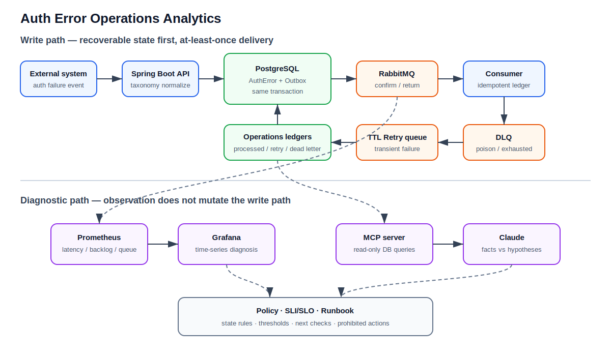

# Auth Error Outbox Pipeline

> 인증 오류 이벤트를 **Transactional Outbox + RabbitMQ + Retry/DLQ**로 안전하게 수집하고, 장애 상황에서도 추적 가능한 상태로 남기는 Backend Reliability 프로젝트입니다.

단순 메시지 발행 예제가 아니라, **중복 delivery, publish 실패, retry 폭주, DLQ 격리, backlog 증가**를 운영 관점에서 다루는 파이프라인입니다.



## Portfolio Signals

| Signal | 구현 포인트 |
| --- | --- |
| Transactional Outbox | AuthError 저장과 Outbox enqueue를 같은 DB transaction으로 처리 |
| Idempotent Consumer | `processed_message.outbox_id` 원장으로 at-least-once 중복 delivery 흡수 |
| Retry / DLQ | DB retry gate, RabbitMQ TTL retry queue, DLQ reason code 원장화 |
| Publish Safety | RabbitMQ publisher confirm/return 기반 success/retry/dead 분기 |
| Observability | E2E latency, Outbox age, queue depth, throughput imbalance로 판단 |
| Load Testing | k6 + Prometheus snapshot + drain verification workflow 구성 |

## Why It Exists

비동기 파이프라인은 API가 200 OK를 반환해도 뒤쪽에서 조용히 실패할 수 있습니다. 이 프로젝트는 “요청을 받았는가?”보다 아래 질문에 집중합니다.

- 이벤트가 DB와 Outbox에 함께 커밋되는가?
- Consumer가 같은 메시지를 여러 번 받아도 안전한가?
- Retry와 DLQ가 정책대로 동작하고 원인 추적이 가능한가?
- API latency가 아니라 E2E latency와 backlog age로 병목을 볼 수 있는가?

## Architecture

```text
API
-> AuthError + Outbox
-> Outbox Poller / Publisher
-> RabbitMQ
-> Consumer + processed_message ledger
-> RetryPublishRequest / TTL Retry Queue
-> DLQ + dead_letter_message ledger
```

핵심은 **DB에 복구 가능한 상태를 먼저 남기고**, RabbitMQ와 Consumer는 at-least-once를 전제로 설계하는 것입니다.

## Reliability Guarantees

현재 구현의 보장 범위입니다.

- **Atomic write**: AuthError와 recorded Outbox를 같은 transaction에서 커밋
- **Idempotency**: API는 `requestId`, Consumer는 `outbox_id` 기준으로 중복 제어
- **Retry durability**: retry publish 의도를 DB에 저장한 뒤 별도 poller가 RabbitMQ로 재발행
- **DLQ visibility**: payload 원문 대신 `payload_hash`, reason code, delivery count 중심으로 추적
- **Backpressure signal**: Outbox age, queue depth, publish/consume imbalance로 병목 판단

강한 exactly-once, 자동 DLQ replay, 운영환경 HA는 아직 보장하지 않습니다. 목표는 **at-least-once + idempotent side effects + operational visibility**입니다.

## Load Test Evidence

로컬 single-node 환경에서 k6와 Prometheus로 아래 신호를 확인했습니다.

| Scenario | Evidence |
| --- | --- |
| LT-001 Baseline | 5 RPS, E2E p95 약 548ms, Outbox backlog 0, Retry/DLQ depth 0 |
| LT-002E Slice | 30/35 RPS 구간은 안정적이고, 40 RPS부터 E2E p95 sustained check가 실패 |
| LT-003 Steady | 30 RPS 15분 steady PASS, E2E p95 max 약 939ms, publish/consume delta 27,000 일치 |
| Knee Estimate | 로컬 single-node 기준 안정 steady 기준선은 30 RPS, 35 RPS는 tail spike 재검증 대상 |
| Workflow | clean start gate -> fixed run window -> drain verification -> Prometheus snapshot |

수치는 로컬 환경 기준이며, 운영환경 성능 보장을 의미하지 않습니다. 이 프로젝트에서 중요한 것은 최고 TPS보다 **장애 신호를 숨기지 않는 측정 방식**입니다.

## Tech Stack

Java 21, Spring Boot 3.5, Spring Data JPA, PostgreSQL, RabbitMQ, Flyway, Micrometer, Prometheus, Grafana, JUnit 5, Testcontainers, k6

## Quick Start

```powershell
docker compose up -d
.\gradlew.bat bootRun --args='--spring.profiles.active=local'
```

```powershell
.\gradlew.bat quickTest
.\scripts\check-testcontainers.ps1
.\gradlew.bat integrationTest
```

Endpoints:

- API: `http://localhost:8080`
- Health: `http://localhost:8080/actuator/health`
- Prometheus: `http://localhost:18081/actuator/prometheus`
- RabbitMQ UI: `http://localhost:15672`

## Docs

- [Architecture](docs/ARCHITECTURE.md)
- [Policy](docs/POLICY.md)
- [Testing](docs/TESTING.md)
- [SLI/SLO](docs/SLI_SLO.md)
- [Runbook](docs/RUNBOOK.md)
- [Load Test Workflow](docs/loadtest/AUTOMATED_WORKFLOW.md)
- [Load Test Result Guide](docs/loadtest/RESULT_INTERPRETATION_GUIDE.md)
- [Load Test Roadmap](docs/loadtest/ROADMAP.md)

## Limitations

- DLQ replay API/worker는 아직 없습니다.
- RabbitMQ/PostgreSQL HA, network partition, multi-instance ordering은 별도 검증 대상입니다.
- `payload_hash` backfill 및 NOT NULL 전환은 후속 결정 사항입니다.
